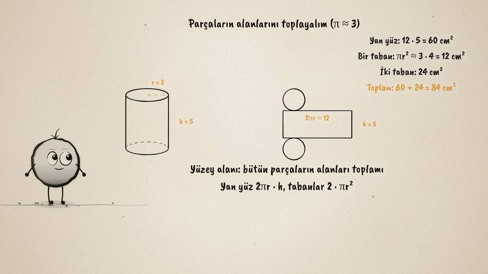
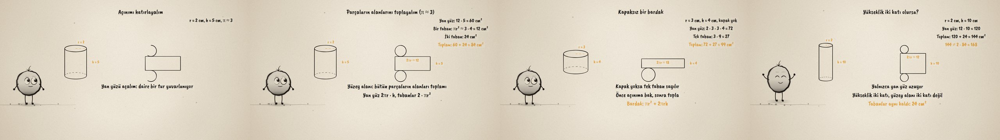

# Silindiri Kapla · Wrapping a Cylinder

**▶ Tarayıcıda izleyin / Watch in the browser:** https://hakanatas.github.io/silindiri-kapla/ 
**⬇ MP4 + altyazılar / MP4 + subtitles:** [Releases](https://github.com/hakanatas/silindiri-kapla/releases) 
**✎ Kullanılan istem / The prompt behind it:** [PROMPT.md](PROMPT.md) 
**🎞 Bütün filmler / All films:** [Nokta'nın Filmleri](https://hakanatas.github.io/nokta-filmleri/?sinif=8)

> **TR —** 8. sınıf matematik "Geometrik Nicelikler" temasındaki MAT.8.4.2 öğrenme çıktısı için hazırlanmış, tamamen JavaScript ile çizilen 92 saniyelik mürekkep animasyonu. Silindir biçimindeki bir kutuyu kapaklarıyla kaplamak için ne kadar kâğıt gerekir? Önce açınım hatırlanıyor: taban dairesi bir tur yuvarlanıyor ve yan yüz, boyu taban çevresi kadar olan bir dikdörtgene açılıyor. π ≈ 3 alınarak yan yüz 12 · 5 = 60 cm², iki taban 24 cm², toplam 84 cm² bulunuyor ve S = 2πr² + 2πrh genellemesine varılıyor. Çıkarım iki örnekle sınanıyor: kapaksız bir bardakta tek taban sayılıyor (99 cm²), yükseklik iki katına çıkınca yalnızca yan yüz büyüyor ve yüzey alanı iki katı olmuyor (144 cm²). Altyazılar Türkçe, İngilizce ya da ikisi birlikte seçilebilir.

A 92-second ink animation for **8th-grade maths**. Nokta, the ink character from [The Learning Ink](https://github.com/hakanatas/the-learning-ink), is the guide again. The can's size is a function of time (`can(t)` in `scenes/scene1.js`), so the same drawing code serves the first can, the cup without a lid, and the can that grows to twice its height while its net stretches beside it.

## Learning outcome

MEB, Türkiye Yüzyılı Maarif Modeli, Ortaokul Matematik, 8th grade, "Geometrik Nicelikler" theme:

**MAT.8.4.2. Dik dairesel silindirin yüzey açınımına ilişkin deneyimlerini dik dairesel silindirin yüzey alanına yansıtabilme**
- a) Dik dairesel silindirin yüzey açınımına ilişkin deneyimlerini gözden geçirir.
- b) Dik dairesel silindirin yüzey alanına yönelik çıkarım yapar.
- c) Çıkarımını farklı örnekler üzerinden değerlendirir.

## Scenes

| # | Time | Scene | What happens | Outcome |
|---|---|---|---|---|
| 1 | 0–10 s | Kutu | How much paper covers a can, lids included? | a |
| 2 | 10–28 s | Açınım | The base circle rolls one turn: a rectangle 2πr long and two circles. | a |
| 3 | 28–46 s | Alan | 60 + 24 = 84 cm², then S = 2πr² + 2πrh. | b |
| 4 | 46–64 s | Bardak | No lid, one base: 72 + 27 = 99 cm². | c |
| 5 | 64–80 s | İki kat | Twice as tall: 144 cm², not 168; only the side grows. | c |
| 6 | 80–92 s | Özet | The side plus two bases. | a–c |

## Running it

- **Preview:** double-click `index.html` (it works offline).
- **MP4:** run `npm install` once, then `npm run export -- --format=horizontal --captions=tr`.
- **Subtitles and narration:** `npm run srt` writes `out/captions_*.srt` and `narration_notes.txt`.
- **Editing:**
  - Caption text, timings and narration notes: `captions.js`
  - Everything on screen is drawn by `LI.world(t)` in `scenes/scene1.js` (the can, the net, the rolling circle, the words); the other scenes only set the camera.
  - Nokta's poses: `src/draw/film.js`; layout for 16:9 and 9:16: `src/draw/kd.js`

It uses the same engine as The Learning Ink: `renderFrame(t)` as a pure function of time, seeded randomness, and frame-by-frame export.

## Lisans · License

**TR —** Bu film ve kodu [Creative Commons Atıf-GayriTicari 4.0 Uluslararası (CC BY-NC 4.0)](https://creativecommons.org/licenses/by-nc/4.0/deed.tr) lisansıyla paylaşılır. Ticari olmayan her amaçla (derste, okulda, eğitim materyalinde) kopyalayabilir, paylaşabilir ve değiştirebilirsiniz; ancak **kaynak göstermek zorunludur**: eser sahibinin adı ve bu deponun bağlantısı belirtilmeden kullanılamaz. Ticari kullanım (satış, ücretli ürün ya da yayın) için izin alınmalıdır.

**EN —** This film and its code are licensed under [Creative Commons Attribution-NonCommercial 4.0 International (CC BY-NC 4.0)](https://creativecommons.org/licenses/by-nc/4.0/). You may copy, share and adapt them for non-commercial purposes, but **attribution is required**: they may not be used without crediting the author and linking to this repository. Commercial use requires permission.

Atıf örneği / Required credit: *“Silindiri Kapla”, Hakan Ataş, Nokta'nın Filmleri — https://github.com/hakanatas/silindiri-kapla — CC BY-NC 4.0*
